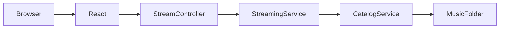
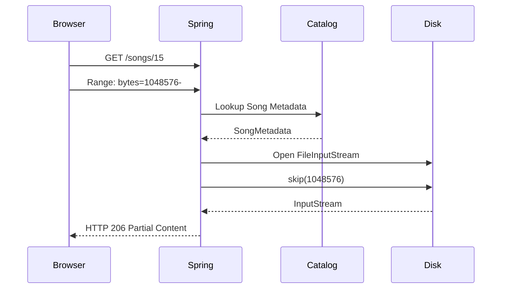

# 🎵 Bajaate Raho

> **A lightweight HTTP audio streaming server built with Spring Boot, implementing byte-range streaming from scratch.**


---

## ✨ Why this project?

Modern browsers don't download an entire audio file before playing it.

Instead, they continuously request **small byte ranges** using the HTTP `Range` header, allowing:

- ▶ Instant playback
- ⏩ Seeking
- 📶 Efficient bandwidth usage
- 💾 Low memory consumption

Rather than relying on Spring Boot's built-in resource handling, **Bajaate Raho** implements the streaming pipeline manually to understand how media streaming actually works under the hood.

---

# 🚀 Features

- ✅ HTTP Audio Streaming
- ✅ HTTP Range Requests
- ✅ 206 Partial Content Responses
- ✅ Browser Seek Support
- ✅ Recursive Music Catalog
- ✅ Streaming using `InputStream`
- ✅ Byte Limited Streaming (`DecoratedInputStream`)
- ✅ React Frontend Integration

---

# 🏗 Architecture



---

# 🔄 Request Flow



---

# 📦 Project Structure

```
src
 ├── catalog
 │      ├── CatalogService
 │      ├── CatalogActualService
 │      └── SongMetadata
 │
 ├── streaming
 │      ├── StreamController
 │      ├── StreamingService
 │      ├── SongResource
 │      └── DecoratedInputStream
 │
 ├── util
 │      └── CatalogRefreshUtil
 │
 └── resources
```

---

# 📚 API

## Stream a song

```
GET /v1/songs/{id}
```

Supports:

```
Range: bytes=100000-
```

Returns:

```
206 Partial Content
```

or

```
200 OK
```

for complete downloads.

---

## Fetch Catalog

```
GET /v1/songs
```

Returns metadata for every indexed song.

---

# ⚙ Configuration

`application.yml`

```yaml
music:
  folder: ${MUSIC_FOLDER:C:/Users/YourUser/Music}
```

You can override the music directory by setting an environment variable.

Windows

```
set MUSIC_FOLDER=D:\Songs
```

Linux

```
export MUSIC_FOLDER=/home/user/Music
```

---

# 🧠 Design Decisions

## Why a Catalog Service?

The catalog scans the filesystem once and caches metadata.

Streaming remains focused solely on reading bytes from disk.

---

## Why DecoratedInputStream?

`FileInputStream.skip()` positions the stream at the requested byte offset.

However, the stream would continue until EOF.

`DecoratedInputStream` wraps the original stream and stops reading after the requested number of bytes, ensuring correct HTTP Range responses.

---

## Why not RandomAccessFile?

`FileInputStream` with `skip()` is sufficient for sequential HTTP streaming.

Keeping the implementation simple makes the streaming pipeline easier to understand while still supporting browser seeking.

---

# 🛣 Roadmap

- [x] Recursive catalog scanning
- [x] HTTP streaming
- [x] Browser seeking
- [x] HTTP Range support
- [x] React player integration
- [ ] MP3 metadata extraction
- [ ] Album artwork
- [ ] Search
- [ ] Shuffle
- [ ] Playlist support
- [ ] Lyrics
- [ ] Streaming statistics
- [ ] Authentication

---

# 💻 Tech Stack

- Java 21
- Spring Boot
- Maven
- React
- HTML5 Audio API

---

# 📖 What I Learned

This project was built as a learning exercise to understand:

- HTTP Range Requests
- Browser media streaming
- Partial Content (206)
- Spring Boot streaming
- Java I/O
- InputStream decoration
- Service-oriented architecture

Rather than using existing streaming libraries, the goal was to understand the complete request lifecycle from the browser to the filesystem.

---

# ⭐ Future Improvements

The long-term goal is to evolve this into a self-hosted music streaming server with:

- Album metadata
- Artist pages
- Playlists
- Search
- Mobile-friendly UI
- Streaming analytics
- Multi-user support

---

## Made with ☕ and curiosity.