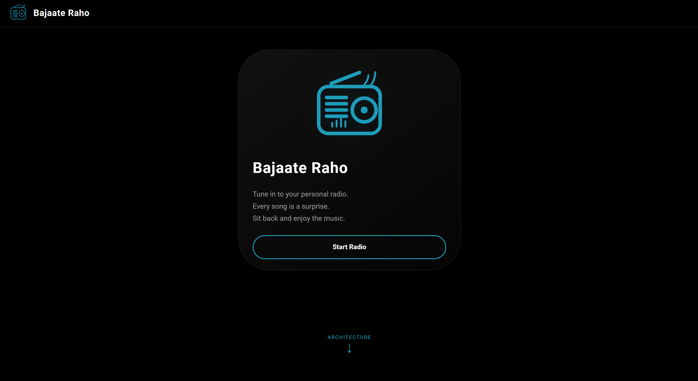
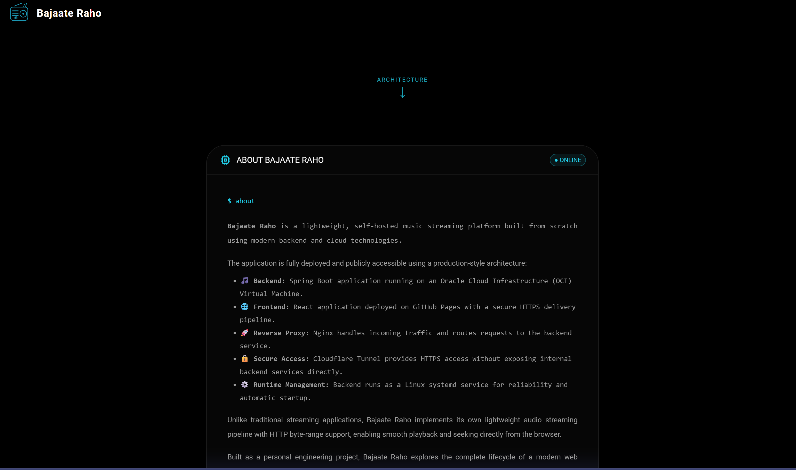
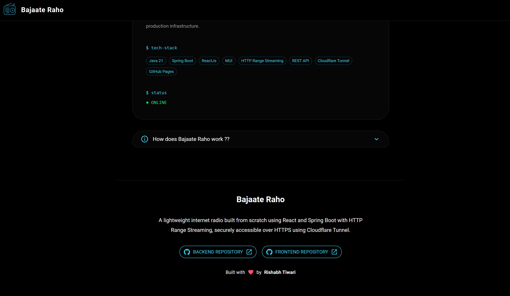

<h1>🎵 Bajaate Raho</h1>

<h3>
A self-hosted internet radio streaming platform built from scratch.
</h3>

Spring Boot • HTTP Range Streaming • Cloudflare Tunnel • React Audio Engine

🎧 What is Bajaate Raho?
Bajaate Raho is a lightweight self-hosted music streaming backend. 
Unlike traditional applications that upload entire audio files, this project implements the same approach used by modern streaming platforms:

Stream only the required bytes when the browser requests them.

🖼️ Screenshots

🏗️ System Architecture
<pre>
USER
|
React Frontend
GitHub Pages
|
HTTPS
|
☁ Cloudflare Tunnel
|
Spring Boot Backend
+-----------------+----------------+
|                                  |
Catalog Service                  Streaming Service
|                                  |
Song Metadata                    HTTP Range Response
|                                  |
+-----------------+----------------+
|
Local Music Library
MP3 Collection
</pre>

☁ Cloudflare Tunnel Integration
<h3 align="center">Securely exposing a self-hosted backend without opening ports.</h3>

Traditional deployment: 
<pre>
Internet → Public IP → Router Port Forwarding → Backend
</pre>

Bajaate Raho deployment: 
<pre>
Backend → Spring Boot → Cloudflare Tunnel → Cloudflare Edge → Internet Users
</pre>

Benefits: 
🔒 No public IP exposure 
🔐 Automatic HTTPS 
🚫 No router port forwarding 
🌎 Accessible globally

🚀 Features
🎵 Streaming Engine → HTTP Range Requests, 206 Partial Content, Browser seeking 
📻 Radio Engine → Random song selection, Metadata API, React player integration 
📂 Catalog System → Recursive scanning, Song indexing, Metadata caching 
🌐 Deployment → Cloudflare Tunnel, HTTPS communication, Self-hosted backend

🔄 Streaming Lifecycle
<pre>
Browser → GET /v1/radio
Spring Boot → Catalog → SongMetadata
Browser → GET /v1/songs/{id} with Range
Spring Boot → Filesystem → Audio Stream
Spring Boot → Browser → 206 Partial Content
</pre>

📡 API Reference
Random Radio 
<pre>
GET /v1/radio
</pre>
Response: 
<pre>
{
"id":15,
"title":"Song Name",
"fileName":"song.mp3"
}
</pre>

Stream Audio 
<pre>
GET /v1/songs/{id}
Range: bytes=start-end
Response: 206 Partial Content
</pre>

📁 Backend Structure
<pre>
src
├── catalog
│   ├── CatalogService
│   ├── CatalogActualService
│   └── SongMetadata
├── streaming
│   ├── StreamController
│   ├── StreamingService
│   ├── SongResource
│   └── DecoratedInputStream
├── config
│   └── CorsConfig
└── resources
└── application.yml
</pre>

🧠 Engineering Highlights
HTTP Range Streaming → Faster start, efficient bandwidth, seeking support 
DecoratedInputStream → Responds only with requested byte ranges 
Catalog Service → Separates song discovery from streaming pipeline

⚙️ Configuration
application.yml 
<pre>
music:
folder: ${MUSIC_FOLDER:C:/Users/User/Music}
</pre>

Override: 
Windows → set MUSIC_FOLDER=D:\Songs 
Linux → export MUSIC_FOLDER=/home/user/Music

🛠️ Tech Stack
Technology	Usage
Java 21	Backend
Spring Boot	REST API
Spring MVC	Streaming
Maven	Build
React	Frontend
HTML5 Audio API	Playback
Cloudflare Tunnel	Secure Deployment

🗺️ Roadmap
✅ Completed → HTTP Streaming, Browser Seeking, Random Radio, Catalog System, React Integration, Cloudflare Deployment 
🚧 Planned → MP3 Metadata Extraction, Album Artwork, Search, Playlists, Lyrics, Analytics, Authentication, Multi-user Support

<h3>
Built with ☕ curiosity and a lot of debugging.
</h3>

